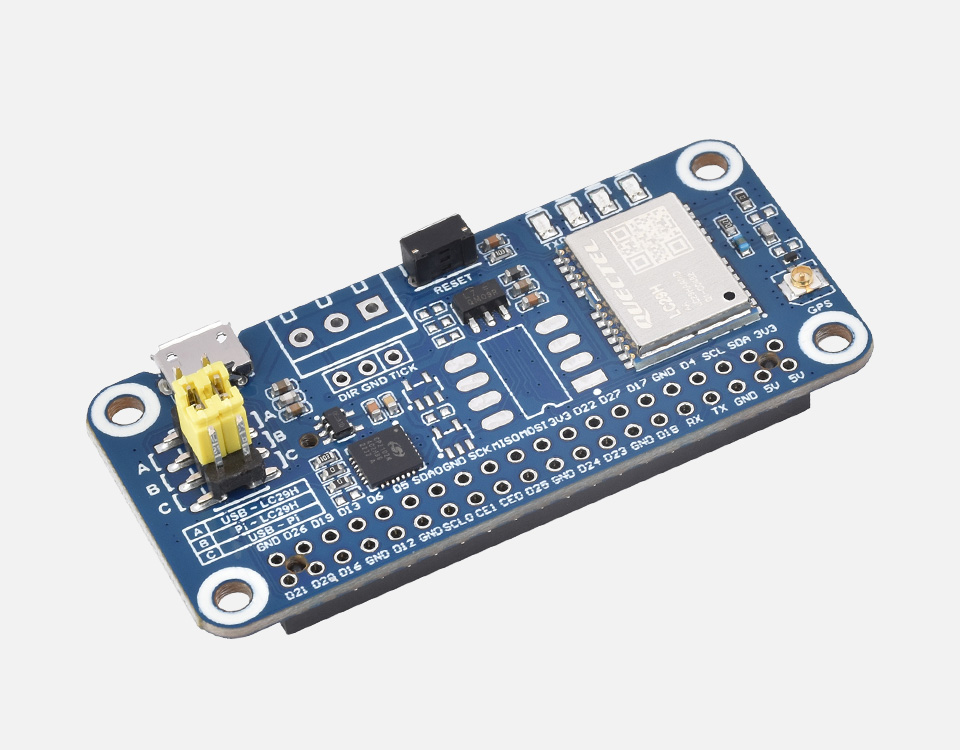
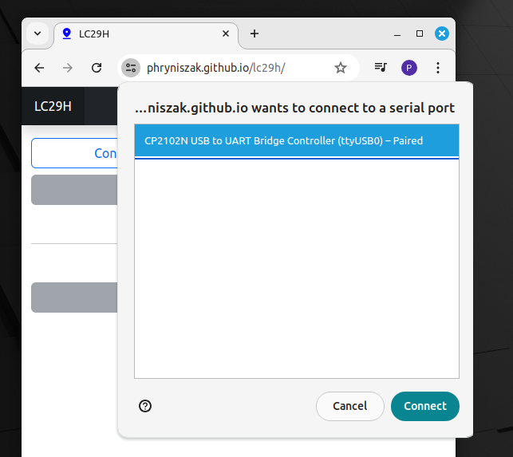
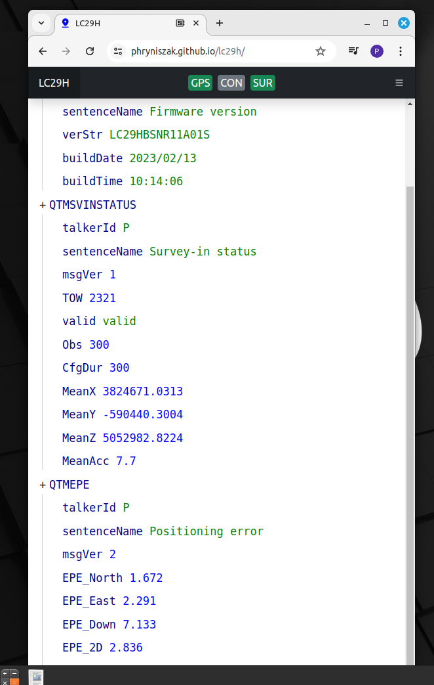
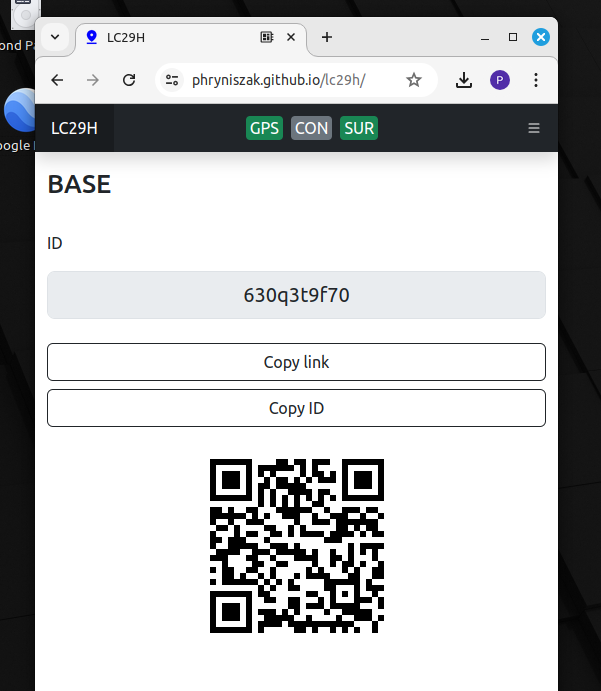

## LC29H

Live here: <https://phryniszak.github.io/lc29h/>

## Warning

During configuration, settings are modified and saved by QTMSAVEPAR.

[What is modified?](src/controller.js)

To revert to default parameters, use the PQTMRESTOREPAR command.

## What is the purpose of it?

Simple RTK base/rover setup using LC29H modules from Waveshare.

[LC29H(DA) GPS/RTK HAT as RTK rover](https://www.waveshare.com/lc29h-gps-hat.htm?sku=25279)

[LC29H(BS) GPS/RTK HAT as RTK base station](https://www.waveshare.com/lc29h-gps-hat.htm?sku=25280)

and web browser as a way to send P2P RTCM correction from base to rover.

## How to use it?

1. Get Waveshare LC29H BS and DA modules.
2. Connect the BS module to the computer.
3. Open <https://phryniszak.github.io/lc29h/>.
4. To connect the base module to the PC, click "Connect Serial".

The connection is confirmed by the green GPS icon at the top of the website.
f modules are connected for the first time, they should be configured by pressing the 'Configure GPS' button ([What is modified?](src/controller.js)).

The SUR green icon confirms the completed survey status.

It is possible to inspect the NMEA output by clicking on "NMEA log" in the side panel.

5. In the next step, connect the phone with the connected rover module to the base station. Get the link to the base station by scanning the QR code with the phone, which is provided by clicking on "P2P connection" in the side panel on the base.

The next steps can be observed in the video below.

The CON green icon confirms connection between the base station and rover.

The RTK green icon confirms the float RTK solution.

In the case of the phone, the only way to connect to the module is by using a USB connection.

NMEA and GPX output to file is supported.

## Notes

- It can only be used on browsers that support the [Web Serial API](https://caniuse.com/web-serial) or [USB API](https://caniuse.com/mdn-api_usb).
- The website offers two ways of connecting to the module: by USB or serial connection. The Waveshare module can be detected as USB or a serial port which blocks USB, which is most likely the case on a PC.
- Communication between modules is realized by WebRTC.